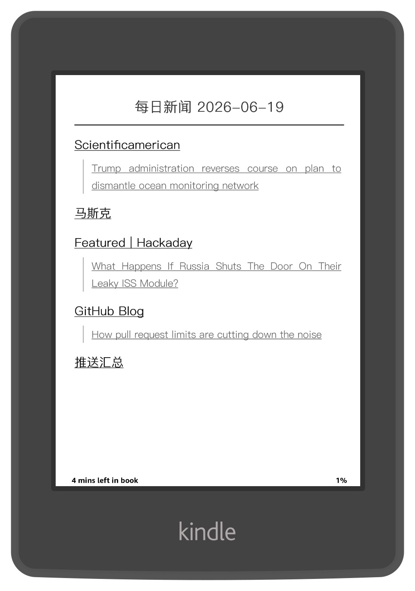

# Ought Gather

[](https://github.com/liusonwood/oughtgather/actions/workflows/daily-gather.yml)
[](https://www.python.org/)
[](LICENSE)
[](docs/EPUB_COMPLIANCE.md)
[](#github-actions-部署)

Ought Gather 是一个 Python 自动化信息聚合工具。它从 RSS、网页、TestMail.app 邮件、Raindrop.io 保存的文章和 LLM 热点分析等可自定义内容源收集内容，去重和清洗后生成 EPUB，并通过 SMTP 邮件或 WEBDAV 发送到 Kindle 阅读。

项目内置 GitHub Actions 工作流：每天定时运行一次，也可以手动触发。工作流会安装依赖、准备 `config.json`、执行 `python src/main.py`、提交去重记录，并把生成的 EPUB 作为 artifact 保留 7 天。

<p align="center">
  
  
  
  
</p>

## 功能

- 内置四类内容源：`rss`、`web`、`mail`、`trending`
- 可以用插件的形式添加自定义内容源
- 生成 EPUB 3.0 文件，包含封面、目录、正文和推送汇总章节
- 封面可使用自定义图片；未配置时尝试使用 Bing 每日壁纸，失败后使用纯色背景
- 支持标题日期占位符 `{time}` 和封面标题换行标记 `</br>`
- 支持按源设置优先级、链接保留、全文抓取、内容裁剪、HTML 过滤和标题关键词删除
- 自动 Emoji 渲染：将文档中的 Emoji 动态渲染为黑白 PNG 图片，确保在 Kindle 等各类阅读器上完美显示，不再依赖自定义字体文件
- 使用 `data/fetched_urls.txt` 记录已处理内容；记录超过 500000 条时保留最新记录
- 支持通过 `CONFIG_JSON` 环境变量提供完整配置，避免把私有源写入仓库

## 环境要求

- Python 3.11+
- 依赖见 `requirements.txt`
- Kindle 推送需要可用的 SMTP 邮箱
- `各订阅源` 需要各自配置 `***_API_KEY`

---

## GitHub Actions 部署

工作流文件是 [.github/workflows/daily-gather.yml](.github/workflows/daily-gather.yml)，每天定时自动运行，也支持手动触发。

### 部署步骤

**1. Fork 仓库**

在 GitHub 页面点击 `Fork`，把项目复制到自己的账号下。

**2. 了解去重缓存机制（无需开启写入权限）**

由于项目引入了 `actions/cache` 机制，去重数据 `data/fetched_urls.txt` 会自动加密保存在 GitHub 的缓存服务器中。

**3. 配置 Secrets**

见下方 [Secrets 配置](#secrets-配置) 一节。

**4. 手动触发一次**

```text
Actions -> Daily Gather -> Run workflow
```

成功运行后：

- `output/` 中生成 EPUB，并作为 artifact 上传（保留 7 天）
- EPUB 通过邮件发送到 `KINDLE_EMAIL`
- `data/fetched_urls.txt` 提交更新，用于下次去重

### 修改运行时间

定时触发由 `on.schedule` 的 `cron` 字段控制，使用 UTC：

```yaml
on:
  schedule:
    - cron: '0 0 * * *'   # UTC 00:00，北京时间约 08:00
  workflow_dispatch:
```

> **注意**：工作流里的 `TZ: Asia/Shanghai` 只影响程序内部的日期和日志，不影响 cron 触发时间。实际触发时间以 GitHub Actions 运行记录为准，可能与 cron 语义有偏差。

### 排查失败

| 现象 | 常见原因 |
| --- | --- |
| 配置准备步骤失败 | `CONFIG_JSON` 不是合法 JSON |
| SMTP 登录失败 | 账号、密码、端口或授权码错误 |
| 邮件发出但 Kindle 未收到 | 发件邮箱未加入 Kindle 认可发件人列表 |
| 没有生成 EPUB | 所有内容已抓取过，或内容源无新文章 |

---

## Secrets 配置

在 GitHub 仓库的 `Settings -> Secrets and variables -> Actions` 中配置，本地开发时通过环境变量设置。

| Secret / 环境变量 | 说明 |
| --- | --- |
| `CONFIG_JSON` | 完整的 `config.json` 字符串；优先级高于项目根目录的 `config.json` 文件。推荐在 GitHub Actions 中使用，可避免将私有订阅源写入仓库 |
| `KINDLE_EMAIL` | Kindle 接收邮箱（`@kindle.com`） |
| `OPENROUTER_API_ENDPOINT` | 自定义 OpenRouter 兼容接口，默认 `https://openrouter.ai/api/v1/chat/completions`。 |
| `OPENROUTER_API_KEY` | OpenRouter API 密钥，用于调用 LLM 生成热点分析。 |
| `OPENROUTER_MODEL` | 使用的 LLM 模型名称。 |
| `QWEATHER_HOST` | 和风天气 API 主机地址。 |
| `QWEATHER_KEY` | 和风天气 API 密钥，用于获取天气数据。 |
| `RAINDROPIO_API_KEY` | Raindrop.io 的 API 访问密钥。 |
| `SMTP_HOST` | 发件邮箱 SMTP 服务器地址，如 `smtp.gmail.com` |
| `SMTP_PASSWORD` | 发件邮箱密码或应用授权码 |
| `SMTP_PORT` | 发件邮箱 SMTP 端口；`465` 使用 SSL，`587` 使用 STARTTLS |
| `SMTP_USERNAME` | 发件邮箱账号 |
| `TAVILY_API_KEY` | Tavily API 密钥，用于搜索热点信息。 |
| `TESTMAIL_APP_API_KEY` | 从 testmail.app 获取的 API Key，用于邮件抓取。 |
| `WEBDAV_ENABLED` | 设置为 `true` 以启用 WebDAV 上传 |
| `WEBDAV_PASSWORD` | WebDAV 密码 |
| `WEBDAV_REMOTE_PATH` | 远程存储路径，默认 `/` |
| `WEBDAV_URL` | WebDAV 服务器地址 |
| `WEBDAV_USERNAME` | WebDAV 用户名 |


###两种推送方式：

- **SEND TO KINDLE**：Kindle 侧需要在亚马逊账号设置里，把发件邮箱加入「已认可的发件人电子邮箱列表」，否则推送不会被接收。
- **WEBDAV**：生成的 EPUB 自动同步至 WebDAV 云端（如坚果云、Nextcloud、本地 NAS 等）。

---
## config.json 说明

完整字段说明见 [docs/CONFIG.md](docs/CONFIG.md)，以下是核心结构速览。

### 顶层字段

| 字段 | 类型 | 必填 | 说明 |
| --- | --- | --- | --- |
| `title` | object | ✓ | EPUB 标题和封面配置 |
| `limit` | int | | 每个内容源的默认抓取上限，默认 `15` |
| `body` | array | ✓ | 内容源列表 |

`title` 子字段：

| 字段 | 说明 |
| --- | --- |
| `text` | 书名，支持 `{time}` 占位符（展开为日期）和 `</br>` 换行 |
| `img` | 封面图片 URL；留空则自动使用 Bing 每日壁纸，失败则用纯色背景 |

### 内容源通用字段

| 字段 | 说明 |
| --- | --- |
| `title` | EPUB 中的章节标题 |
| `type` | `rss`、`web`、`mail`、`trending` 或自定义插件类型名 |
| `src` | 内容源地址或关键词，所有类型必填 |
| `priority` | 排序值，数值越大越靠前；默认 `0`，相同值保持配置顺序 |
| `keep_link` | `Y`（默认）保留 `<a>` 标签；`N` 移除链接标签只保留文字 |
| `exclude` | HTML 内容过滤规则，支持 `start` / `end` / `exact` 三种模式 |
| `delete` | 逗号分隔的关键词；标题包含任一关键词时跳过整篇文章 |
| `metadata` | 不同fetcher定义的扩展配置 |

### 最小配置示例

```json
{
  "title": {
    "text": "{每日新闻 {time}}",
    "img": ""
  },
  "limit": 15,
  "body": [
    {
      "type": "rss",
      "src": "https://hnrss.org/frontpage",
      "title": "Hacker News",
      "priority": 10,
      "keep_link": "Y",
      "full_text": "N"
    }
  ]
}
```

---

## Config Editor 使用

项目提供了一个可视化 HTML 配置编辑器，无需安装任何依赖。

**在线版**（推荐）：

```text
https://liusonwood.github.io/oughtgather/
```

**离线版**：直接在浏览器中打开仓库里的 `config-editor.html`。

### 主要功能

- 支持全部内容源类型（`rss` / `web` / `mail` / `trending` 及自定义插件），切换类型时自动切换专属字段
- 导入已有 `config.json`，可视化添加 / 删除 / 拖拽排序内容源
- 导入已有 `opml.xml`，快速配置rss
- 编辑排除规则（`exclude`）和扩展参数（`metadata`）
- 通过下载或复制到剪贴板导出最终 JSON
- 所有改动自动保存到 `localStorage`，刷新不丢失

### 抓取器参数同步

在 `src/fetchers/` 新增自定义抓取器后，编辑器需要同步更新才能显示新插件的参数字段：

**方式一**：Actions自动同步

**方式二**：手动触发同步

```bash
python3.11 scripts/update_editor.py
```

---


## 本地开发部署

### 1. 安装依赖

```bash
pip install -r requirements.txt
```

### 2. 准备配置

```bash
cp config.template.json config.json
# 编辑 config.json，或用 config-editor.html 可视化编辑后复制进来
```

### 3. 设置环境变量

```bash
export SMTP_HOST="smtp.example.com"
export SMTP_PORT="587"
export SMTP_USERNAME="sender@example.com"
export SMTP_PASSWORD="app-password"
export KINDLE_EMAIL="name@kindle.com"
```

### 4. 运行

```bash
python3.11 src/main.py
```

有新内容时，程序在 `output/` 下生成 EPUB，并尝试发送到 `KINDLE_EMAIL`。日志写入 `logs/`。


### 5. 测试文件

```bash
# 运行全部测试
python3.11 -m pytest tests/
```

**EPUBCheck 校验**：

使用 [epubcheck](https://github.com/w3c/epubcheck) 验证生成的 EPUB 是否符合 EPUB 3 标准

把 `epubcheck.jar` 放在 `epubcheck/epubcheck.jar`，然后运行：

```bash
python3.11 -m pytest tests/test_integration.py::TestEpubcheckValidation -v
```

更多说明见 [docs/TESTING.md](docs/TESTING.md) 和 [docs/EPUB_COMPLIANCE.md](docs/EPUB_COMPLIANCE.md)。

---


## 开发新的 Fetcher

项目采用插件化抓取器架构，新增内容源类型只需在 `src/fetchers/` 添加一个文件，无需修改主入口。

### 开发规则

- 继承 `BaseFetcher`（`from src.fetchers.base import BaseFetcher`）
- 声明唯一的类属性 `type_name`，用于在 `config.json` 中通过 `"type"` 字段识别
- 实现 `fetch(self) -> FetchResult` 方法，返回 `FetchResult` 对象
- 文件命名：`src/fetchers/<type_name>_fetcher.py`
- 注册是自动的，模块加载时即完成注册

### 使用 LLM 快速生成

[docs/new_fetcher_prompt_template.md](docs/new_fetcher_prompt_template.md) 提供了一个可复制给任意 LLM 的开发提示词模板，填入你的需求后即可自动生成符合架构规范的 fetcher 代码。使用前回答模板开头的 5 个问题：

1. 目标数据源是什么？（网站、API、RSS 等）
2. `config.json` 中需要哪些配置字段？（`src` 的含义、`metadata` 参数等）
3. 是否需要 API Key 等凭据？
4. 如何解析文章内容？（HTML 标签、JSON 字段位置等）
5. 是否有特殊处理需求？（内容过滤、重试策略等）

### 关键父类方法

| 方法 | 说明 |
| --- | --- |
| `self._make_request(url, ...)` | 封装 HTTP 请求，内置重试 |
| `self._extract_images(html)` | 从 HTML 提取图片 URL 列表 |
| `self._should_delete(title)` | 检查标题是否匹配 `delete` 关键词 |
| `self._restore_img_tags(html)` | 修复 trafilatura 输出的非标准图片标签 |

### 代码框架

```python
from src.config import ContentSource, get_secret
from src.fetchers.base import BaseFetcher, FetchResult, Article

class MyFetcher(BaseFetcher):
    type_name = "my_type"                    # config.json 中的 type 值
    src_placeholder = "输入提示文字"           # config-editor 中 src 字段的占位符
    config_schema = {                        # config-editor 中显示的专属字段
        "metadata.my_param": {
            "type": "text",
            "label": "自定义参数",
            "placeholder": "请输入..."
        }
    }

    def fetch(self) -> FetchResult:
        result = FetchResult(source=self.source, articles=[])
        try:
            url = self.source.src
            response = self._make_request(url)
            # ... 解析内容 ...
            article = Article(title="标题", content="<p>内容</p>", url=url)
            if not self._should_delete(article.title):
                result.articles.append(article)
        except Exception as e:
            result.success = False
            result.error = str(e)
        return result
```

新增 fetcher 后，运行 `python3.11 scripts/update_editor.py` 同步到 `config-editor.html`。

---


## 项目结构

```text
.
├── LICENSE
├── README.md
├── config-editor.html
├── config.json
├── config.template.json
├── GEMINI.md
├── requirements.txt
├── data/               # 去重数据库
│   └── fetched_urls.txt
├── docs/               # 开发文档
│   ├── CONFIG.md
│   ├── EPUB_COMPLIANCE.md
│   ├── TESTING.md
│   ├── WORKFLOW.md
│   ├── design.md
│   ├── new_fetcher_prompt_template.md
│   └── testmail-api.md
├── epubcheck/          # EPUB 标准校验工具
│   ├── epubcheck.jar
│   └── lib/
├── img/                # Kindle 效果图片
├── Fonts/              # 字体文件 (NotoEmoji-Medium.ttf, README_Emoji.txt, etc.)
├───scripts/            # 辅助脚本
│   ├───update_editor.py
│   ├───update_readme_secrets.py
│   └───update_workflow_secrets.py
├── src/                # 核心源代码
│   ├── main.py
│   ├── config.py
│   ├── dedup/          # 去重逻辑
│   ├── epub/           # EPUB 生成
│   ├── fetchers/       # 数据源抓取器
│   ├── mailer/         # 邮件发送
│   ├── processors/     # 内容与图片处理
│   ├── uploader/       # WebDAV 上传
│   └── utils/          # 工具与日志
└── tests/              # 测试套件
```

**目录说明：**
- `src/`: 项目核心逻辑，包含各个功能模块的实现。
- `docs/`: 详细的架构设计、开发指南及合规性文档。
- `tests/`: 覆盖全功能的单元测试与集成测试，确保 EPUB 生成与抓取逻辑正确。
- `epubcheck/`: 用于验证生成的 EPUB 3 文件是否严格符合国际标准。
- `data/`: 自动维护的内容去重数据库。

---


## 许可证

GNU AGPLv3.0，见 [LICENSE](LICENSE)。
